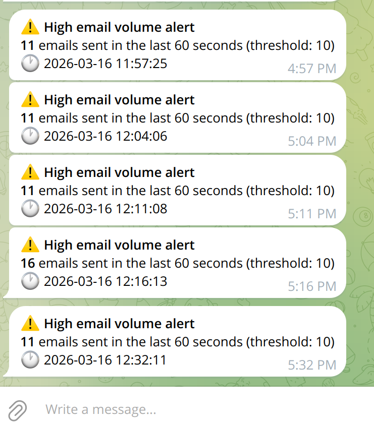

# postwatch

Monitors Postfix email sending rate and sends a Telegram alert when the volume exceeds a configurable threshold within a sliding time window.

## How it works

- Tails `/var/log/mail.log` in real-time
- Counts lines containing `status=sent` (one per delivered email) using a sliding window
- Fires a Telegram alert when the count exceeds `THRESHOLD` within `WINDOW_SECONDS`
- Repeats alerts at most once every `COOLDOWN_SECONDS` to avoid notification spam
- Sends a startup confirmation message on service start

## Example



## Requirements

- Linux with Postfix
- Python 3.6+
- A Telegram bot (see setup instructions below)

## Creating a Telegram bot

1. Open Telegram and search for **@BotFather**
2. Send `/newbot`
3. Choose a **name** for your bot (e.g. "Postwatch Alerts")
4. Choose a **username** for your bot (must end in `bot`, e.g. `postwatch_alerts_bot`)
5. BotFather will reply with your **bot token** — save it for `TELEGRAM_BOT_TOKEN`
6. To get your **chat ID**:
   - Send any message to your new bot
   - Open `https://api.telegram.org/bot<YOUR_TOKEN>/getUpdates` in a browser
   - Look for `"chat":{"id":123456789}` in the response — that number is your `TELEGRAM_CHAT_ID`

## Installation

1. **Clone the repository**
   ```bash
   git clone https://github.com/acosonic/postwatch.git /root/alerter
   cd /root/alerter
   ```

2. **Create the `.env` file**
   ```bash
   cp .env.example .env
   ```
   Edit `.env` and fill in your values:
   ```ini
   TELEGRAM_BOT_TOKEN=your_bot_token
   TELEGRAM_CHAT_ID=your_chat_id
   THRESHOLD=10
   WINDOW_SECONDS=60
   COOLDOWN_SECONDS=300
   ```

3. **Install the systemd service**
   ```bash
   cp postwatch.service /etc/systemd/system/email-monitor.service
   systemctl daemon-reload
   systemctl enable email-monitor
   systemctl start email-monitor
   ```

## Configuration

All settings are in `.env`:

| Variable | Default | Description |
|----------|---------|-------------|
| `TELEGRAM_BOT_TOKEN` | — | Bot token from @BotFather |
| `TELEGRAM_CHAT_ID` | — | Telegram user or chat ID to receive alerts |
| `THRESHOLD` | `10` | Max emails allowed within the window before alerting |
| `WINDOW_SECONDS` | `60` | Sliding window size in seconds |
| `COOLDOWN_SECONDS` | `300` | Minimum seconds between repeated alerts |

After changing `.env`, restart the service:
```bash
systemctl restart email-monitor
```

## Useful commands

```bash
systemctl status email-monitor       # service status
journalctl -u email-monitor -f       # live logs
tail -f /var/log/email_monitor.log   # file log
```
